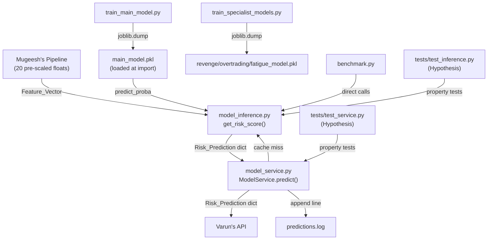

# Design Document

## Behavioral Risk Detection Engine — Rishikesh's Module

---

## Overview

The Behavioral Risk Detection Engine is a self-contained Python module that lives under `rishikesh/` at the workspace root. It sits in the middle of a three-party pipeline:

```
Mugeesh's Pipeline  →  [20 pre-scaled floats]  →  Rishikesh's Module  →  [Risk_Prediction dict]  →  Varun's API
```

The module's responsibilities are:

1. **Inference** — accept a 20-float Feature_Vector, run it through a trained RandomForest classifier, and return a structured 6-field Risk_Prediction dict.
2. **Caching** — avoid redundant computation by storing results keyed on `user_id:trade_id`.
3. **Logging** — append one structured line per new prediction to `predictions.log`.
4. **Training** — provide reproducible scripts that generate synthetic data and train the main multi-class model plus three binary specialist models.
5. **Benchmarking** — validate that mean inference latency stays below 50 ms across 1000 calls.
6. **Testing** — property-based test suites (Hypothesis) that verify output invariants across the full input space.

The module never re-scales or transforms the Feature_Vector. Mugeesh's pipeline delivers values that are already normalized; the Inference_Engine passes them directly to the model.

---

## Architecture

### Component Diagram



### Layered Design

The module has two functional layers:

| Layer | File | Responsibility |
|---|---|---|
| Inference | `model_inference.py` | Validate input, call model, build output dict |
| Service | `model_service.py` | Cache, time, log, delegate to inference layer |

The inference layer is stateless and pure (given a fixed loaded model). The service layer holds mutable state (the cache dict) and performs I/O (log file writes). This separation makes the inference layer straightforward to property-test without any mocking.

---

## Components and Interfaces

### `model_inference.py` — Inference Engine

**Module-level initialization:**

```python
import joblib, math, os

_MODEL_PATH = os.path.join(os.path.dirname(__file__), "models", "main_model.pkl")
_model = joblib.load(_MODEL_PATH)   # loaded once at import time
```

If `main_model.pkl` is absent, `joblib.load` raises `FileNotFoundError` — this propagates to the caller unchanged.

**Public interface:**

```python
def get_risk_score(features: list) -> dict:
    """
    Parameters
    ----------
    features : list
        Exactly 20 numeric (int or float) values, pre-scaled by Mugeesh's pipeline.
        Must contain no NaN or inf values.

    Returns
    -------
    dict with keys:
        risk_score        : int   in [0, 100]
        behavior_type     : str   one of 6 Behavior_Type labels
        confidence        : float in [0.0, 1.0]
        sub_scores        : dict  6 probability keys summing to 1.0 ±0.01
        alert_message     : str   non-empty human-readable message
        intervention_level: str   "NONE" | "WARN" | "BLOCK"

    Raises
    ------
    ValueError  — wrong length, non-numeric element, NaN/inf value
    """
```

**Validation logic (executed before any model call):**

1. Check `len(features) == 20`; if not, raise `ValueError(f"Expected 20 features, got {len(features)}")`.
2. For each element, check `isinstance(v, (int, float))`; if not, raise `ValueError(f"Feature at index {i} is not numeric: type={type(v)}")`.
3. For each element, check `math.isfinite(v)`; if not, raise `ValueError(f"Feature at index {i} contains NaN or inf: value={v}")`.

**Inference logic:**

```python
proba = _model.predict_proba([features])[0]   # shape (6,)
classes = _model.classes_                      # e.g. ['FATIGUE_TRADING', 'IMPULSIVE_ENTRY', ...]

# Build sub_scores mapping
_KEY_MAP = {
    "NORMAL":           "normal_probability",
    "REVENGE_TRADING":  "revenge_trading_probability",
    "OVERTRADING":      "overtrading_probability",
    "IMPULSIVE_ENTRY":  "impulsive_entry_probability",
    "FATIGUE_TRADING":  "fatigue_trading_probability",
    "TILT":             "tilt_probability",
}
sub_scores = {_KEY_MAP[cls]: float(p) for cls, p in zip(classes, proba)}

highest_prob = max(proba)
behavior_type = classes[proba.argmax()]
risk_score = int(highest_prob * 100)
confidence = float(highest_prob)
```

**Intervention level mapping:**

```python
if risk_score <= 39:
    intervention_level = "NONE"
elif risk_score <= 69:
    intervention_level = "WARN"
else:
    intervention_level = "BLOCK"
```

**Alert message mapping:**

| `behavior_type` | `alert_message` |
|---|---|
| `NORMAL` | `"Trading behavior looks healthy. Continue as planned."` |
| `REVENGE_TRADING` | `"Possible emotional trading detected after a loss. Consider stepping back."` |
| `OVERTRADING` | `f"You have placed {int(features[1])} trades this session. Overtrading detected — step away."` |
| `IMPULSIVE_ENTRY` | `"Trade entry detected without proper setup. Slow down and review your plan."` |
| `FATIGUE_TRADING` | `"Trading fatigue detected. You may be trading during off-hours or after a long session."` |
| `TILT` | `"Multiple risk signals detected simultaneously. This is a high-risk state. Trade blocked."` |

---

### `model_service.py` — Model Service

**Class interface:**

```python
class ModelService:
    def __init__(self):
        self._cache: dict[str, dict] = {}
        # logging configured to write to rishikesh/predictions.log

    def predict(self, user_id: str, trade_id: str, features: list) -> dict:
        """
        Returns a Risk_Prediction dict.
        Cache hit  → returns stored result, no log write.
        Cache miss → calls get_risk_score, stores result, appends log line.
        """
```

**Cache key:** `f"{user_id}:{trade_id}"`

**predict() flow:**

```
cache_key = f"{user_id}:{trade_id}"
if cache_key in self._cache:
    return self._cache[cache_key]          # cache hit — no I/O

t0 = time.perf_counter()
result = get_risk_score(features)
ms_taken = (time.perf_counter() - t0) * 1000

self._cache[cache_key] = result
_append_log(trade_id, result, ms_taken)    # write to predictions.log
if ms_taken > 100:
    logging.warning(f"Slow prediction: trade_id={trade_id} latency={ms_taken:.2f}ms")

return result
```

**Log line format:**

```
[2024-01-15T10:23:45.123456] trade_id=T001 behavior=NORMAL risk=72 ms=3.45
```

- `TIMESTAMP` — `datetime.utcnow().isoformat()`
- `ms_taken` — rounded to 2 decimal places
- File opened in append mode (`"a"`); parent directory created with `os.makedirs(..., exist_ok=True)` if absent.

---

### `train_main_model.py` — Main Model Training

**Synthetic data generation:**

- 6 classes × ≥100 samples each = ≥600 total samples
- 20 features per sample, drawn from distributions that make each class distinguishable
- `random_state=42` for reproducibility

**Training:**

```python
from sklearn.ensemble import RandomForestClassifier
import joblib, json, os
from datetime import datetime, timezone

clf = RandomForestClassifier(random_state=42)
clf.fit(X_train, y_train)

os.makedirs("rishikesh/models", exist_ok=True)
joblib.dump(clf, "rishikesh/models/main_model.pkl")

metadata = {
    "model_type": "RandomForestClassifier",
    "n_features": 20,
    "classes": list(clf.classes_),
    "trained_at": datetime.now(timezone.utc).isoformat()
}
with open("rishikesh/models/model_metadata.json", "w") as f:
    json.dump(metadata, f, indent=2)

print(f"Model saved to rishikesh/models/main_model.pkl")
print("Training complete.")
```

No `StandardScaler` or any other transformer is applied.

---

### `train_specialist_models.py` — Specialist Model Training

Three binary classifiers, each trained with the same 20-feature synthetic data:

| Model file | Positive class | Negative class |
|---|---|---|
| `revenge_model.pkl` | `REVENGE_TRADING` | all others |
| `overtrading_model.pkl` | `OVERTRADING` | all others |
| `fatigue_model.pkl` | `FATIGUE_TRADING` | all others |

Each uses `RandomForestClassifier(random_state=42)`. No feature scaling. A confirmation line is printed for each saved model.

---

### `benchmark.py` — Latency Benchmark

```python
import time, random
from model_inference import get_risk_score

vectors = [[random.uniform(0.0, 1.0) for _ in range(20)] for _ in range(1000)]
latencies = []

for v in vectors:
    t0 = time.perf_counter()
    get_risk_score(v)
    latencies.append((time.perf_counter() - t0) * 1000)

latencies.sort()
mean_ms = sum(latencies) / len(latencies)
print(f"min={latencies[0]:.3f}ms  max={latencies[-1]:.3f}ms  mean={mean_ms:.3f}ms"
      f"  p95={latencies[949]:.3f}ms  p99={latencies[989]:.3f}ms")
assert mean_ms < 50, f"Mean latency {mean_ms:.3f}ms exceeds 50ms threshold"
```

Calls `get_risk_score` directly — no `ModelService` involvement.

---

### `tests/test_inference.py` — Inference Property Tests

Uses `hypothesis` with `@given(st.lists(st.floats(allow_nan=False, allow_infinity=False), min_size=20, max_size=20))` as the primary strategy for valid Feature_Vectors.

### `tests/test_service.py` — Service Property Tests

Uses `hypothesis` with `@given(st.text(), st.text(), ...)` strategies for `user_id` and `trade_id` values.

---

## Data Models

### Feature_Vector

```
list[float | int]  — length exactly 20, no NaN, no inf
```

Fixed schema (0-indexed):

| Index | Name | Notes |
|---|---|---|
| 0 | `win_rate` | |
| 1 | `trade_count_session` | Used in OVERTRADING alert; cast to `int` |
| 2 | `after_loss_flag` | |
| 3 | `rapid_reentry_flag` | |
| 4 | `session_duration_minutes` | |
| 5 | `avg_hold_time_minutes` | |
| 6 | `risk_reward_ratio` | |
| 7 | `position_size_ratio` | |
| 8 | `drawdown_pct` | |
| 9 | `trades_per_hour` | |
| 10 | `consecutive_losses` | |
| 11 | `hour_of_day` | |
| 12 | `day_of_week` | |
| 13 | `pnl_last_trade` | |
| 14 | `pnl_session_total` | |
| 15 | `session_high_pnl` | |
| 16 | `volatility_index` | |
| 17 | `news_event_flag` | |
| 18 | `avg_slippage` | |
| 19 | `emotional_score` | |

### Risk_Prediction

```python
{
    "risk_score":         int,    # [0, 100]
    "behavior_type":      str,    # one of 6 Behavior_Type labels
    "confidence":         float,  # [0.0, 1.0]
    "sub_scores": {
        "normal_probability":           float,
        "revenge_trading_probability":  float,
        "overtrading_probability":      float,
        "impulsive_entry_probability":  float,
        "fatigue_trading_probability":  float,
        "tilt_probability":             float,
    },
    "alert_message":      str,    # non-empty
    "intervention_level": str,    # "NONE" | "WARN" | "BLOCK"
}
```

Invariants:
- `sum(sub_scores.values()) ≈ 1.0` (±0.01)
- `behavior_type == argmax(sub_scores)`
- `risk_score == int(confidence * 100)`
- `intervention_level` is determined solely by `risk_score` thresholds

### model_metadata.json

```json
{
  "model_type": "RandomForestClassifier",
  "n_features": 20,
  "classes": ["FATIGUE_TRADING", "IMPULSIVE_ENTRY", "NORMAL", "OVERTRADING", "REVENGE_TRADING", "TILT"],
  "trained_at": "2024-01-15T10:00:00.000000+00:00"
}
```

### Prediction_Cache (in-memory)

```python
dict[str, dict]   # key: "{user_id}:{trade_id}", value: Risk_Prediction
```

Instance-scoped; starts empty on each `ModelService()` construction.

### Log Line

```
[{ISO8601_TIMESTAMP}] trade_id={trade_id} behavior={behavior_type} risk={risk_score} ms={ms_taken:.2f}
```

---

## Correctness Properties

*A property is a characteristic or behavior that should hold true across all valid executions of a system — essentially, a formal statement about what the system should do. Properties serve as the bridge between human-readable specifications and machine-verifiable correctness guarantees.*

---

### Property 1: Output has exactly 6 keys

*For any* valid 20-float Feature_Vector, the dict returned by `get_risk_score` SHALL contain exactly the keys `{"risk_score", "behavior_type", "confidence", "sub_scores", "alert_message", "intervention_level"}` — no more, no fewer.

**Validates: Requirements 3.1, 11.2**

---

### Property 2: risk_score is int in [0, 100]

*For any* valid 20-float Feature_Vector, `result["risk_score"]` SHALL be of Python type `int` and its value SHALL satisfy `0 <= risk_score <= 100`.

**Validates: Requirements 3.2, 11.3**

---

### Property 3: confidence is float in [0.0, 1.0]

*For any* valid 20-float Feature_Vector, `result["confidence"]` SHALL be of Python type `float` and its value SHALL satisfy `0.0 <= confidence <= 1.0`.

**Validates: Requirements 3.4, 11.4**

---

### Property 4: behavior_type is one of 6 valid strings

*For any* valid 20-float Feature_Vector, `result["behavior_type"]` SHALL be a member of `{"NORMAL", "REVENGE_TRADING", "OVERTRADING", "IMPULSIVE_ENTRY", "FATIGUE_TRADING", "TILT"}`.

**Validates: Requirements 3.3, 11.5**

---

### Property 5: intervention_level is consistent with risk_score

*For any* valid 20-float Feature_Vector, the `intervention_level` in the returned dict SHALL satisfy:
- `risk_score` in [0, 39] → `intervention_level == "NONE"`
- `risk_score` in [40, 69] → `intervention_level == "WARN"`
- `risk_score` in [70, 100] → `intervention_level == "BLOCK"`

**Validates: Requirements 4.1, 4.2, 4.3, 4.4, 11.6**

---

### Property 6: sub_scores has 6 keys summing to 1.0 ±0.01

*For any* valid 20-float Feature_Vector, `result["sub_scores"]` SHALL contain exactly the 6 keys `{"normal_probability", "revenge_trading_probability", "overtrading_probability", "impulsive_entry_probability", "fatigue_trading_probability", "tilt_probability"}`, each with a `float` value in [0.0, 1.0], and `abs(sum(sub_scores.values()) - 1.0) <= 0.01`.

**Validates: Requirements 3.5, 3.6, 11.7**

---

### Property 7: behavior_type matches highest sub_scores key

*For any* valid 20-float Feature_Vector, the `behavior_type` in the result SHALL correspond to the `sub_scores` key with the highest probability value (i.e., `behavior_type` is the argmax of `sub_scores`).

**Validates: Requirements 3.7, 11.11**

---

### Property 8: alert_message is a non-empty string

*For any* valid 20-float Feature_Vector, `result["alert_message"]` SHALL be a `str` with `len(alert_message) > 0`.

**Validates: Requirements 5.7, 11.10**

---

### Property 9: Invalid-length input raises ValueError

*For any* list whose length is not 20 (both shorter and longer), calling `get_risk_score` SHALL raise a `ValueError`.

**Validates: Requirements 1.2, 11.8**

---

### Property 10: Same user_id:trade_id returns identical cached result

*For any* valid `user_id` string, `trade_id` string, and Feature_Vector, calling `ModelService.predict(user_id, trade_id, features)` twice on the same instance SHALL return dicts with identical contents.

**Validates: Requirements 6.1, 6.5, 12.1**

---

### Property 11: Different trade_ids are independently cached

*For any* `user_id` and two distinct `trade_id` values, the result stored for one SHALL NOT affect the result stored for the other — retrieving one cache entry SHALL leave the other unchanged.

**Validates: Requirements 6.3, 6.4, 12.2**

---

### Property 12: New prediction appends exactly one log line

*For any* new `user_id:trade_id` combination (not previously seen by the `ModelService` instance), calling `predict` SHALL append exactly one line to `predictions.log`.

**Validates: Requirements 7.1, 12.4**

---

### Property 13: Cached prediction does not append to log

*For any* `user_id:trade_id` combination that has already been predicted by the same `ModelService` instance, a subsequent call to `predict` with the same pair SHALL NOT append any new line to `predictions.log`.

**Validates: Requirements 7.5, 12.5**

---

## Error Handling

### Validation Errors (ValueError)

All validation happens at the top of `get_risk_score` before any model call:

| Condition | Error message pattern |
|---|---|
| Wrong length | `"Expected 20 features, got {actual_len}"` |
| Non-numeric element | `"Feature at index {i} is not numeric: type={type(v)}"` |
| NaN or inf value | `"Feature at index {i} contains NaN or inf: value={v}"` |

These errors propagate directly to the caller (Varun's API or the test suite). No swallowing or wrapping.

### Model File Missing (FileNotFoundError)

If `main_model.pkl` is absent at import time, `joblib.load` raises `FileNotFoundError`. This is intentional — the module cannot function without the model. The error message from joblib includes the full path, satisfying Requirement 2.3.

**Mitigation:** Run `train_main_model.py` before importing `model_inference`. The training script creates the file and prints the save path.

### Log File Creation

`ModelService` uses `os.makedirs(log_dir, exist_ok=True)` before the first write, so a missing `rishikesh/` directory or `predictions.log` file is handled transparently.

### Slow Prediction Warning

If `ms_taken > 100`, `ModelService` emits a `logging.warning(...)` via Python's standard `logging` module. This does not affect the return value or raise an exception.

### Benchmark Assertion

`benchmark.py` raises `AssertionError` with the actual mean value if mean latency ≥ 50 ms. This is a hard gate — the script exits non-zero, signaling a deployment blocker.

---

## Testing Strategy

### Overview

The testing approach uses two complementary layers:

- **Property-based tests** (Hypothesis) — verify universal invariants across the full input space with ≥100 iterations per property.
- **Example-based / smoke tests** — verify specific behaviors, error messages, and one-time setup conditions.

### Property-Based Testing Library

**Library:** `hypothesis` (Python)
**Configuration:** `@settings(max_examples=100)` minimum per property test.
**Tag format:** Each test is annotated with a comment: `# Feature: behavioral-risk-detection-engine, Property {N}: {property_text}`

### `tests/test_inference.py`

**Strategies:**

```python
valid_feature_vector = st.lists(
    st.floats(allow_nan=False, allow_infinity=False, allow_subnormal=False),
    min_size=20, max_size=20
)

invalid_length_vector = st.one_of(
    st.lists(st.floats(allow_nan=False, allow_infinity=False), max_size=19),
    st.lists(st.floats(allow_nan=False, allow_infinity=False), min_size=21)
)
```

**Property tests (P1–P9):**

| Test | Property | Strategy |
|---|---|---|
| `test_output_has_exactly_6_keys` | P1 | `valid_feature_vector` |
| `test_risk_score_is_int_in_range` | P2 | `valid_feature_vector` |
| `test_confidence_is_float_in_range` | P3 | `valid_feature_vector` |
| `test_behavior_type_is_valid` | P4 | `valid_feature_vector` |
| `test_intervention_level_consistent` | P5 | `valid_feature_vector` |
| `test_sub_scores_structure_and_sum` | P6 | `valid_feature_vector` |
| `test_behavior_type_matches_argmax` | P7 | `valid_feature_vector` |
| `test_alert_message_nonempty` | P8 | `valid_feature_vector` |
| `test_invalid_length_raises_valueerror` | P9 | `invalid_length_vector` |

**Example tests:**

- `test_missing_model_raises_file_not_found` — mock path, verify `FileNotFoundError` on import.
- `test_nan_input_raises_valueerror` — pass vector with `float('nan')`, verify `ValueError`.
- `test_inf_input_raises_valueerror` — pass vector with `float('inf')`, verify `ValueError`.
- `test_overtrading_alert_contains_trade_count` — verify `{n}` interpolation uses `int(features[1])`.
- `test_exact_alert_messages` — verify fixed-string messages for all non-OVERTRADING behavior types.

### `tests/test_service.py`

**Strategies:**

```python
user_id_strategy = st.text(min_size=1)
trade_id_strategy = st.text(min_size=1)
```

**Property tests (P10–P13):**

| Test | Property | Strategy |
|---|---|---|
| `test_same_pair_returns_identical_result` | P10 | `user_id_strategy`, `trade_id_strategy` |
| `test_different_trade_ids_are_independent` | P11 | `user_id_strategy`, two distinct `trade_id_strategy` values |
| `test_new_prediction_appends_log_line` | P12 | `user_id_strategy`, `trade_id_strategy` |
| `test_cached_prediction_no_log_write` | P13 | `user_id_strategy`, `trade_id_strategy` |

**Example tests:**

- `test_new_instance_has_empty_cache` — create two `ModelService` instances, verify independent caches.
- `test_slow_prediction_emits_warning` — mock `time.perf_counter` to simulate >100 ms, verify `logging.warning` is called.
- `test_log_file_created_if_missing` — delete log file, call `predict`, verify file exists.

### Unit / Smoke Tests

- Verify `model_inference._model` is loaded at import time (not `None`).
- Verify `model_inference._model` identity is stable across multiple `get_risk_score` calls.
- Verify `train_main_model.py` creates `main_model.pkl` and `model_metadata.json` with correct structure.
- Verify `train_specialist_models.py` creates all three specialist `.pkl` files.

### Running Tests

```bash
# From workspace root
cd rishikesh
python -m pytest tests/ -v

# Run benchmark separately (not part of pytest suite)
python benchmark.py
```

### Dependencies

```
scikit-learn
joblib
hypothesis
pytest
numpy
```
